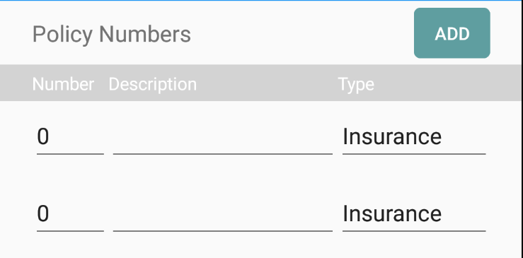
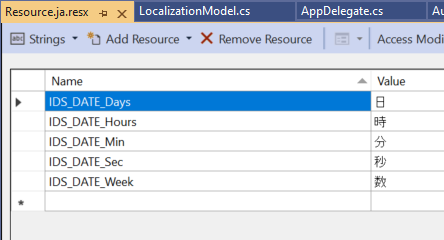
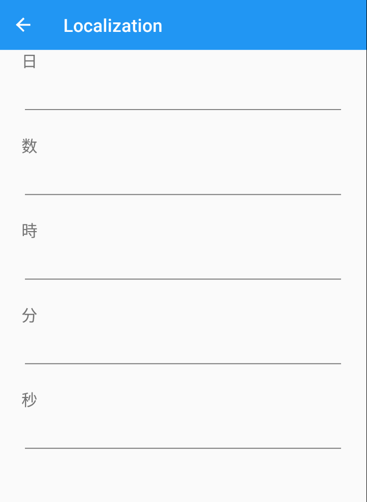

**AutoForms** is a Xamarin.Forms control that can dynamically generate UI powered by the data model you give it.

To use **AutoForms** simply add the control in your xaml and then bind it to your data model.  On your model you add certain attributes to each property telling AutoForms how it should behave.

## Supported platforms

- [x] Android
- [x] iOS
- [x] UWP
- [?] Other Platforms (Should work but I haven't tested)

## Example
**xaml**
```xml
<AutoForms LabelStyle="{StaticResource DefaultLabelStyle}"/>
```

**C#**
```cs
public class HelloModel
    {
        public enum Relation
        {
            [Description("Parent")]
            Parent,
            [Description("Child")]
            Child,
            [Description("Grandparent")]
            Grandparent,
            [Description("No Relation")]
            NoRelation
        }

        [AutoForms("First Name")]
        public string Firstname { get; set; }

        [AutoForms("Last Name")]
        public string Lastname { get; set; }

        [AutoForms("Date of Birth")]
        public DateTime DOB { get; set; }

        [AutoForms("Relation")]
        public Relation RelationToClient { get; set; }
    }
```

|       |  |
| ----------- | ----------- |
|      |        |
| UWP      | Android |

## Horizontal grouping controls
Controls can be displayed in a horizontal grouping
```cs
[AutoFormsHorizontalGroup(3, GridUnitType.Star)]
[AutoForms("Phone Number", AutoFormsType.Entry, grouped: new string[] { nameof(Phone) })]
public string PhoneNumber { get; set; }

[AutoFormsHorizontalGroup(1, GridUnitType.Star)]
[AutoForms(" ")]
public PhoneType Phone { get; set; }

```


## More Controls
There are many more controls than listed here.  Check the sample application to view them all
```cs
[AutoForms("Click Me", itemStyle:"DefaultButtonStyle")]
public ICommand MyButton { get; set; }

[AutoForms("Checkbox")]
public bool Check { get; set; }

public enum EnumRadioType { One, Two }

[AutoFormsRadioButton("Radio buttons", AutoFormsOrientation.Horizontal)]
public EnumRadioType? MyRadioEnum { get; set; }

public enum EnumType { First, Second, Third }

[AutoForms("Select Buttons", AutoFormsType.SelectButton, itemStyle: "DefaultSelectButtonStyle")]
public EnumType? MySelectButton { get; set; }
```
 

## Lists
Growing lists of items can be included in your forms

```cs
[AutoFormsList("Policy Numbers",
            commands: new string[] { nameof(AddPolicyCommand) },
            emptyListMessage: "No policy numbers have been entered yet. Add one above.",
            nestedListView: true)]
public ObservableCollection<PolicyNumber> PolicyNumbers { get; set; }
```

 

## Validation
There is both active validation on supported properties as well as the ability to query the validation states

```cs
public class ValidationModel
    {
        public AutoFormsValidation AutoFormsValidation { get; set; }

        [AutoForms("Name")]
        [AutoFormsRequired]
        [AutoFormsMaxLength(10)]
        public string Name { get; set; }

        [AutoForms("Email")]
        [AutoFormsRequired]
        [AutoFormsMaxLength(10)]
        [AutoFormsEmail]
        public string Email { get; set; }

        [AutoFormsHorizontalGroup(1, GridUnitType.Star)]
        [AutoForms(" ", AutoFormsType.Entry, placeholder: "CC", grouped: new string[] { nameof(PhoneNumber), nameof(Extension) })]
        [AutoFormsMaxLength(5)]
        [AutoFormsRequired]
        public string CountryCode { get; set; }

        [AutoFormsHorizontalGroup(3, GridUnitType.Star)]
        [AutoForms(" ", AutoFormsType.Entry, placeholder:"Number")]
        [AutoFormsMaxLength(10)]
        [AutoFormsMinLength(5)]
        [AutoFormsRequired]
        public string PhoneNumber { get; set; }

        [AutoFormsHorizontalGroup(1, GridUnitType.Star)]
        [AutoForms(" ", AutoFormsType.Entry, placeholder:"Ext")]
        [AutoFormsMaxLength(4)]        
        [AutoFormsRequired]
        public string Extension { get; set; }
    }
```

 

## Filtering

The same model can be used to show multiple generated UI for different scenarios.
```cs 
public class FilteringModel
{
    public enum FilterType
    {
        Login = 1 << 0,
        Create = 1 << 1,
    }

    public string FilteringType => typeof(FilterType).FullName;
    public string Filter { get; set; }

    [AutoForms("Login", 
        horizontalLabelOptions: AutoFormsLayoutOptions.Center, 
        paddingTop: 40,
        filter: (int)(FilterType.Login))]
    public object LabelLogin { get; set; }

    [AutoForms("Create", 
        horizontalLabelOptions: AutoFormsLayoutOptions.Center,
        paddingTop: 40,
        filter: (int)(FilterType.Create))]
    public object LabelCreate { get; set; }

    [AutoFormsHorizontalGroup(1, GridUnitType.Star, filter: (int)(FilterType.Create))]
    [AutoForms("Name", placeholder: "First", filter: (int)(FilterType.Create), grouped: new string[] { nameof(LastName) })]
    public string FirstName { get; set; }

    [AutoFormsHorizontalGroup(1, GridUnitType.Star, filter: (int)(FilterType.Create))]
    [AutoForms(" ", placeholder: "Last", filter: (int)(FilterType.Create))]
    public string LastName { get; set; }

    [AutoForms(" ", placeholder:"Email", filter:(int)(FilterType.Create | FilterType.Login))]
    public string Email { get; set; }

    [AutoForms(" ", placeholder: "Password", filter: (int)(FilterType.Create | FilterType.Login))]
    public string Password { get; set; }

    [AutoForms("Login", itemStyle: "DefaultButtonStyle", filter: (int)(FilterType.Login))]
    public ICommand LoginCommand { get; set; }

    [AutoForms("Create", itemStyle: "DefaultButtonStyle", filter: (int)(FilterType.Create))]
    public ICommand CreateCommand { get; set; }

}
```
 *Note: the top tab control is a separate control, not generated by AutoForms.

  

## Localization
In order to get localization working there are a few steps you need to take. First create your localization localization resx files and place them in your project.  Next tell AutoForms where the Assemblies are located (your app and also the folder where the resources are kept).  Note that if AutoForms does not find the localization it will revert to the string it was given. 
```cs
// Resource string
AutoFormsConstants.ApplicationPath = "AutoForms.Test";
AutoFormsConstants.StringResourcePath = "AutoForms.Test.Resources.Resource";
AutoFormsConstants.CultureOverride = null; // optional
```
Here is an example localized model:
```cs
public class LocalizationModel
{
    [AutoForms("IDS_DATE_Days")]
    public string Days { get; set; }

    [AutoForms("IDS_DATE_Week")]
    public string Week { get; set; }

    [AutoForms("IDS_DATE_Hours")]
    public string Hours { get; set; }

    [AutoForms("IDS_DATE_Min")]
    public string Min { get; set; }

    [AutoForms("IDS_DATE_Sec")]
    public string Sec { get; set; }
}
```
|       |  |
| ----------- | ----------- |
|      |        |

 ## AutoFormsConstants
 This is a static configuration class where you can specifiy certain UX and styling variables used by AutoForms.  There are several controls that require the use of an Icon font (Radio,Checkbox,List Action), which if used, would be needed to be included into your project.  Have a look at the sample application how the Material Icon font was included with the project (App.xaml.cs).

 ## Contributions
 All comments, suggestions, programming help is fully welcome.

## Todo
- ~~Localization for all labels~~
- More data types and controls
- More configuration options
