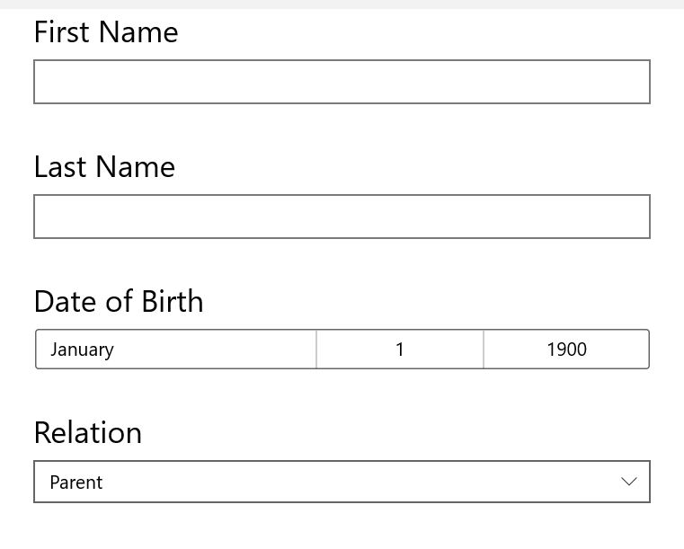
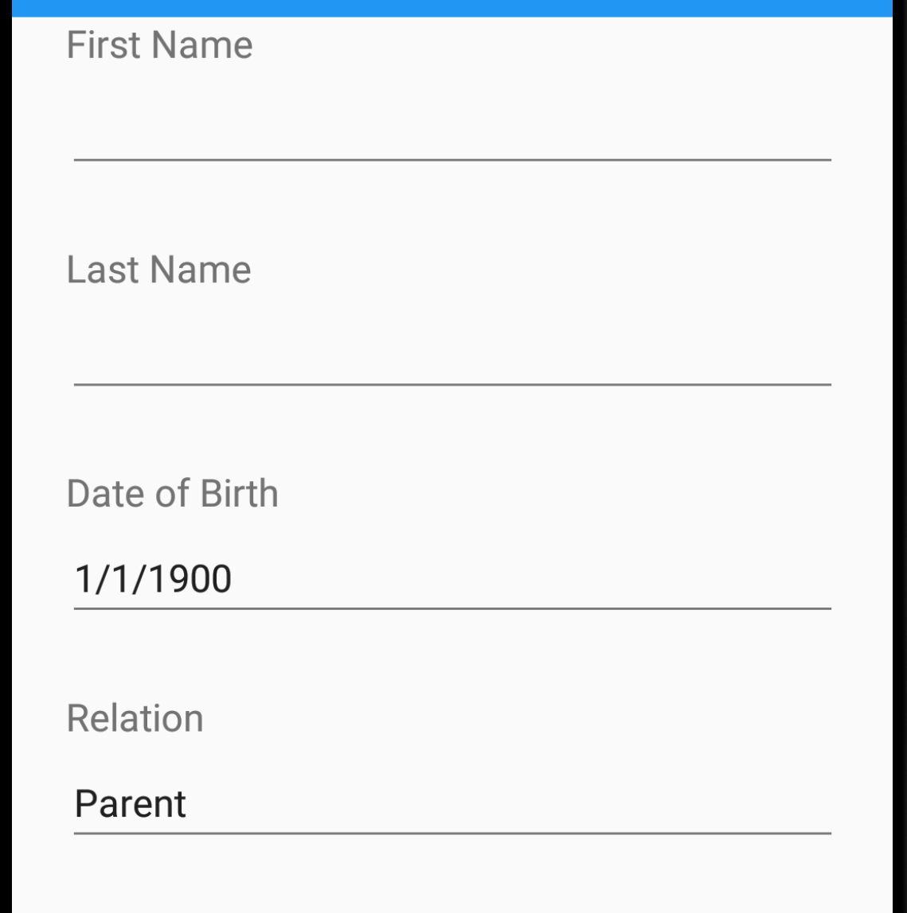
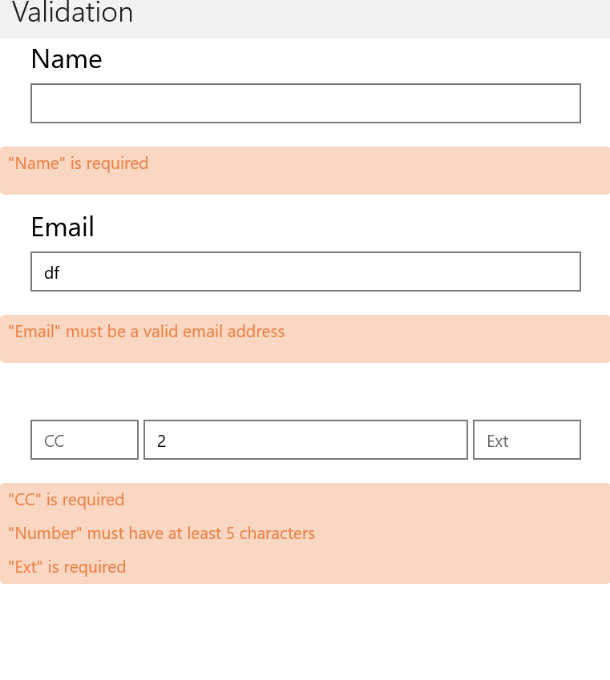
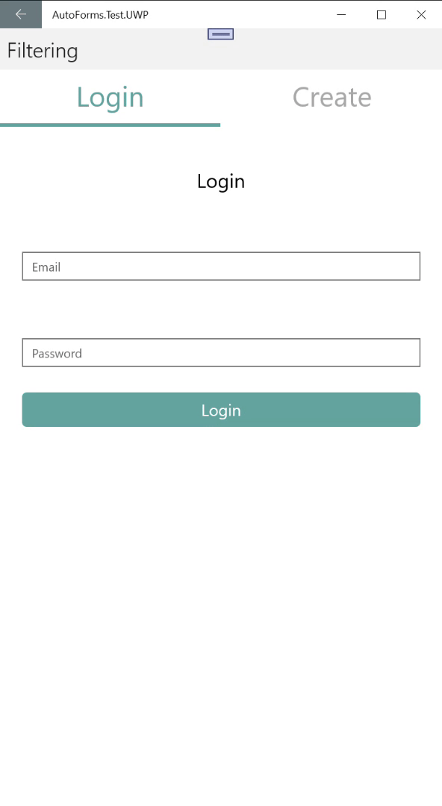

**AutoForms** is a Xamarin.Forms control that can dynamically generate UI powered by the data model you give it.

To use **AutoForms** simply add the control in your xaml and then bind it to your data model.  On your model you add certain attributes to each property telling AutoForms how it should behave.

### Example
**xaml**
```xml
<AutoForms LabelStyle="{StaticResource DefaultLabelStyle}"/>
```

**C#**
```cs
public class HelloModel
    {
        public enum Relation
        {
            [Description("Parent")]
            Parent,
            [Description("Child")]
            Child,
            [Description("Grandparent")]
            Grandparent,
            [Description("No Relation")]
            NoRelation
        }

        [AutoForms("First Name")]
        public string Firstname { get; set; }

        [AutoForms("Last Name")]
        public string Lastname { get; set; }

        [AutoForms("Date of Birth")]
        public DateTime DOB { get; set; }

        [AutoForms("Relation")]
        public Relation RelationToClient { get; set; }
    }
```

|       |  |
| ----------- | ----------- |
|      |        |
| UWP      | Android |

### Validation
There is both active validation on supported properties as well as the ability to query the validation states

```cs
public class ValidationModel
    {
        public AutoFormsValidation AutoFormsValidation { get; set; }

        [AutoForms("Name")]
        [AutoFormsRequired]
        [AutoFormsMaxLength(10)]
        public string Name { get; set; }

        [AutoForms("Email")]
        [AutoFormsRequired]
        [AutoFormsMaxLength(10)]
        [AutoFormsEmail]
        public string Email { get; set; }

        [AutoFormsHorizontalGroup(1, GridUnitType.Star)]
        [AutoForms(" ", AutoFormsType.Entry, placeholder: "CC", grouped: new string[] { nameof(PhoneNumber), nameof(Extension) })]
        [AutoFormsMaxLength(5)]
        [AutoFormsRequired]
        public string CountryCode { get; set; }

        [AutoFormsHorizontalGroup(3, GridUnitType.Star)]
        [AutoForms(" ", AutoFormsType.Entry, placeholder:"Number")]
        [AutoFormsMaxLength(10)]
        [AutoFormsMinLength(5)]
        [AutoFormsRequired]
        public string PhoneNumber { get; set; }

        [AutoFormsHorizontalGroup(1, GridUnitType.Star)]
        [AutoForms(" ", AutoFormsType.Entry, placeholder:"Ext")]
        [AutoFormsMaxLength(4)]        
        [AutoFormsRequired]
        public string Extension { get; set; }
    }
```

 

### Filtering

The same model can be used to show multiple generated UI for different scenarios.
```cs 
public class FilteringModel
    {
        public enum FilterType
        {
            Login = 1 << 0,
            Create = 1 << 1,
        }

        public string FilteringType => typeof(FilterType).FullName;
        public string Filter { get; set; }

        [AutoForms("Login", 
            horizontalLabelOptions: AutoFormsLayoutOptions.Center, 
            paddingTop: 40,
            filter: (int)(FilterType.Login))]
        public object LabelLogin { get; set; }

        [AutoForms("Create", 
            horizontalLabelOptions: AutoFormsLayoutOptions.Center,
            paddingTop: 40,
            filter: (int)(FilterType.Create))]
        public object LabelCreate { get; set; }

        [AutoFormsHorizontalGroup(1, GridUnitType.Star, filter: (int)(FilterType.Create))]
        [AutoForms("Name", placeholder: "First", filter: (int)(FilterType.Create), grouped: new string[] { nameof(LastName) })]
        public string FirstName { get; set; }

        [AutoFormsHorizontalGroup(1, GridUnitType.Star, filter: (int)(FilterType.Create))]
        [AutoForms(" ", placeholder: "Last", filter: (int)(FilterType.Create))]
        public string LastName { get; set; }

        [AutoForms(" ", placeholder:"Email", filter:(int)(FilterType.Create | FilterType.Login))]
        public string Email { get; set; }

        [AutoForms(" ", placeholder: "Password", filter: (int)(FilterType.Create | FilterType.Login))]
        public string Password { get; set; }

        [AutoForms("Login", itemStyle: "DefaultButtonStyle", filter: (int)(FilterType.Login))]
        public ICommand LoginCommand { get; set; }

        [AutoForms("Create", itemStyle: "DefaultButtonStyle", filter: (int)(FilterType.Create))]
        public ICommand CreateCommand { get; set; }

    }
```


 
 
 *Note: the top tab control is a separate control, not created by AutoForms.
